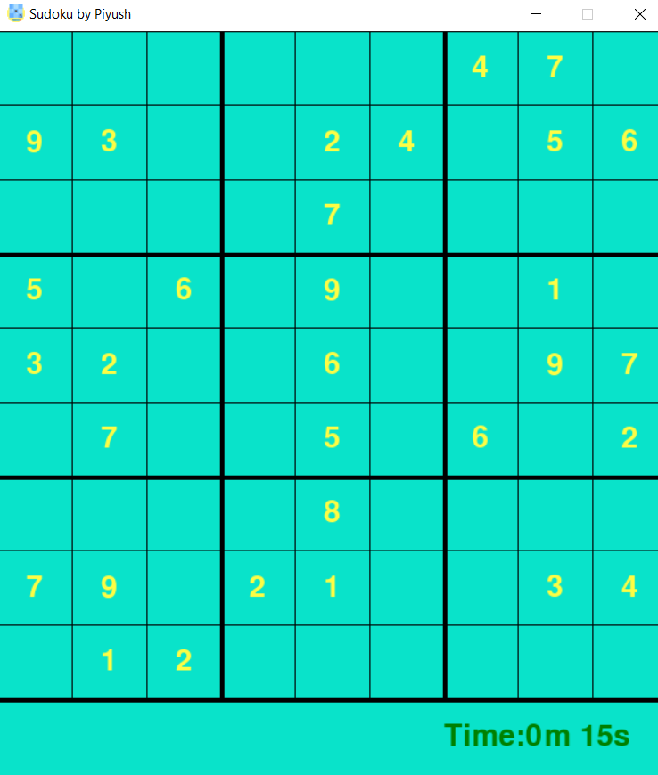

<h1 align = 'center'> Sudoku solving game </h1>
<h5> This is a sudoku solving game implemented using backtracking algorithm. It uses pygame for excellent user interface. </h5>
<h5> Playing instructions: - </h5>
<ul>
  <li> When you will run run.py file, a window will appear containing sudoku with time lapse showing at the bottom right corner of the game window. </li>
  <li> You will have to click the box which you want to fill (1 - 9). Then fill your number from the keyboard. </li>
  <li> If you will press enter, the value will be fixed if it will be correct otherwise you will get 'X' sign at bottom left corner indicating that your move was wrong. </li>
  <li> After you will successfully fill all the boxes, the game window will automatically get closed indicating that the game is over. 
</ul>

<h4 align = 'center'> Image of the game window </h4>

  

